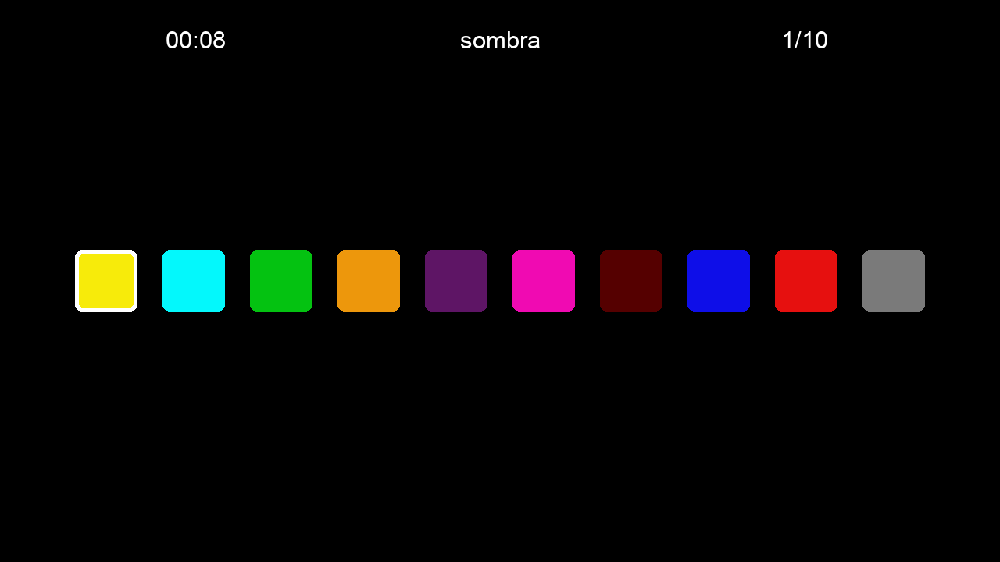

# pudu-ui

UI library and framework for creating games and desktop apps with Python and
based in pyglet.

The design is **retained mode** with an **imperative** 
paradigm, allowing for complex and performant applications, and widgets with 
different states that use an Object-Oriented Programming approach.

The components use GLSL shaders for rendering, allowing pixel level control 
of their look.

It doesn't use native OS controls. That means that your apps 
would look the same regardless of the platform.

It has different components available:

## Components

- Button
- Dropdown
- Frame
- GridLayout
- Image
- ImageButton
- Label
- ListLayout
- PopUp
- ProgressBar
- Slider
- Toggle

## Examples

There are many examples using the UI components that you can find in the 
_examples_ folder.

You can run them like this:

`uv run examples/hello_screen.py`

### Hello World

Here's the hello screen example:

```python
from pudu_ui import App, Label, LabelParams
import pudu_ui


app = App(background_color=pudu_ui.colors.WHITE)


if __name__ == '__main__':
    # Regular text
    params = LabelParams(x=50, y=200, text="Hello World")
    label = Label(params, batch=app.batch)

    # Text anchored right
    fs = pudu_ui.styles.fonts.p2()
    fs.color = pudu_ui.colors.GRAY
    params = LabelParams(
        x=200, y=150, text="Trying something", anchor_x='right', style=fs
    )
    l2 = Label(params, batch=app.batch)

    # Centered text
    fs = pudu_ui.styles.fonts.p3()
    params = LabelParams(
        x=(50 + 150 // 2), y=100, text="Centered text", anchor_x='center',
        anchor_y='center', style=fs
    )
    l3 = Label(params, batch=app.batch)

    app.run()
```

### Params and Style

To avoid having too many parameters on the constructors of component classes we
use the **Params** class, which is a dataclass that stores all parameters for a 
Widget. Specific components have their own Params class, in this case 
**LabelParams** that inherits from Params attributes like *x*, *y*, *width*, 
*height*, 
etc. but also define new attributes like *text*, *anchor_x*, *anchor_y* and 
*style*.

```py
# widget.py

@dataclass
class Params:
    x: float = 0.0
    y: float = 0.0
    width: int = 100
    height: int = 100
    focusable: bool = True
    visible: bool = True
    debug_label_color: Color = field(default_factory=default_debug_label_color)
```
```py
# label.py

@dataclass
class LabelParams(Params):
    text: str = ""
    anchor_x: Literal['left', 'center', 'right'] = 'left'
    anchor_y: Literal['top', 'bottom', 'center', 'baseline'] = 'baseline'
    multiline: bool = False
    resize_type: LabelResizeType = LabelResizeType.NONE
    rotation: float = 0.0
    style: FontStyle = field(default_factory=styles.fonts.p1)
```

We also define specific **Style** dataclasses for each component that needs 
styling.
With the objective of separating that data and being able to reuse it. This 
way we don't end up with a Label constructor that has 20+ parameters.

```py
# styles/fonts.py

@dataclass
class FontStyle:
    font_size: Union[float, int, str] = DEFAULT_FONT_SIZE
    font_name: str = DEFAULT_FONT_NAME
    weight: str = 'normal'
    italic: bool = False
    color: Color  = field(default_factory=default_font_color)
    opacity: int = 255
```

Widgets can also be given a pyglet **Batch** so that they are attached to 
them and drawn with them later. You can also use **Group** for rendering order. 
And they can have parents so their position is relative to them.

### Example game

I made a small puzzle game that uses **pudu-ui** and is free and open-source.
It's a good example of how you can use this library:

https://github.com/sombra-studio/10-de-10




## MVC Framework

With the idea of separating the logic from the view we provide the 
**Controller** and **Screen** classes.

For a given screen in your app, you should write most of the logic in a 
custom controller class that inherits from **Controller**. That one is 
responsible for creating the screen and populating it with data, and that 
should be done in the *on_load* method.

You should implement a custom screen class that inherits from **Screen** 
that creates all of its widgets and populates them with the data given on 
the screen's *\__init__* method.

## Objective

- To be used in games and apps made at Sombra Studio
- To be cross-platform
- To be simple
- To work well in complex applications

## Limitations

- For now, it assumes a fixed resolution screen. That means that it's not 
  responsive, if you change the width and height of the Window the widgets 
  inside don't change

## Testing

To run them:

`python -m unittest -v tests`

This will run every test in the "_tests_" module, if you add new tests make sure to
import them into the "_\_\_init\_\_.py_" file of the "_tests_" folder.

## Dependencies

- pyglet

You can install the dependencies by running:

`uv sync`

or

`python -m pip install -r requirements.txt`

## Documentation

You can see it at https://sombra.studio/pudu-ui/

If you want to contribute to the documentation you can add it or edit the 
Markdown files from the **/docs** folder.

The project uses MkDocs, Material for MkDocs and mike to build the static 
website for documentation.

To build the documentation locally you can do:

``uv run --group docs mkdocs build --strict``

To run the documentation locally you do:

`uv run --group docs mkdocs serve`