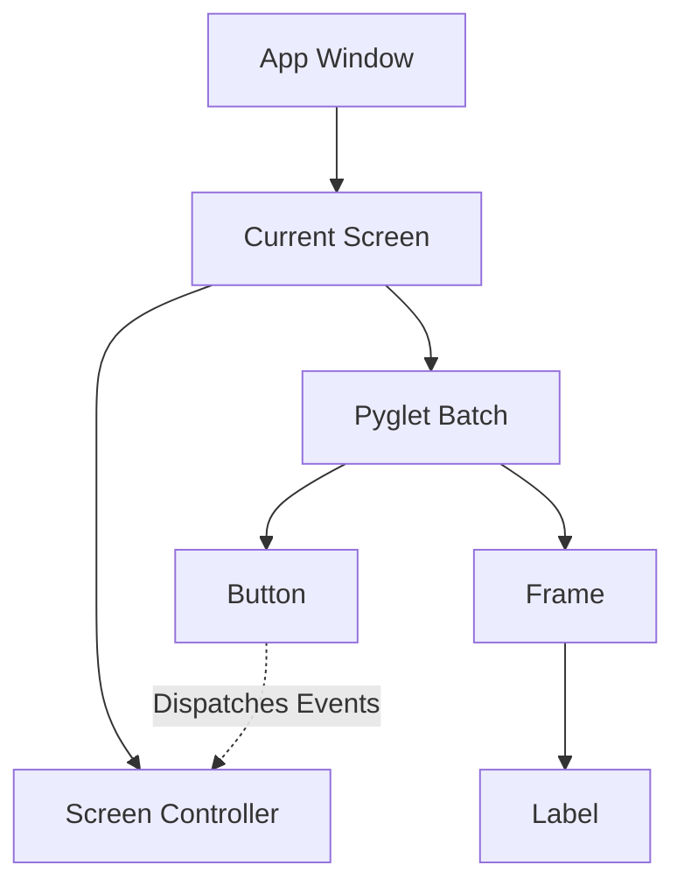
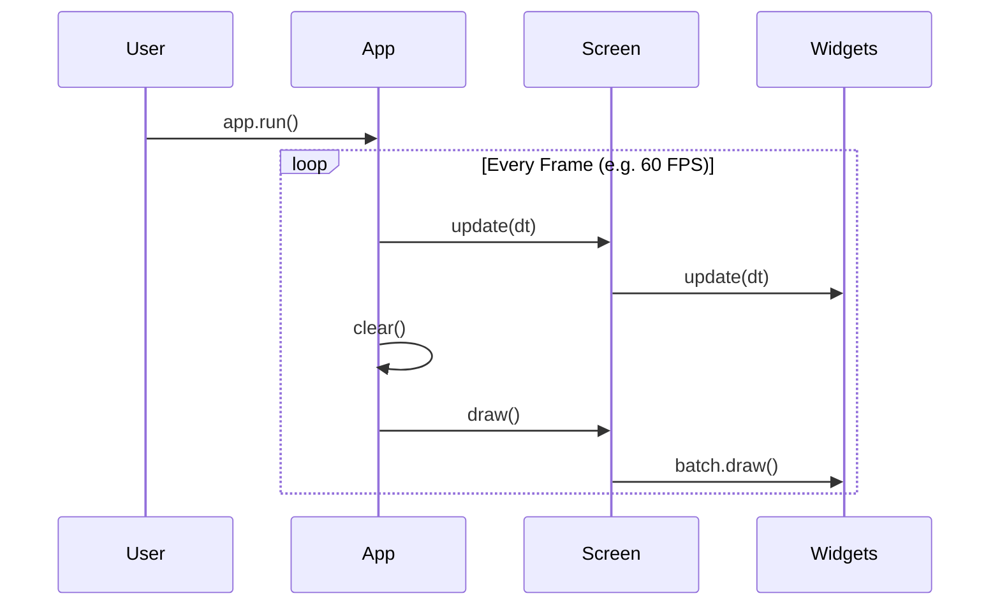

# Architecture

`pudu-ui` is built from the ground up for 2D games and desktop tools in Python. This section outlines its fundamental design principles.

---

## Retained Mode & Imperative UI

Unlike immediate mode UI libraries (like Dear PyGui or Dear ImGui) where UI trees are re-declared every frame, `pudu-ui` operates in **retained mode**:

- **Persistent Widget Objects**: Widgets (`Button`, `Label`, `Frame`, etc.) are instantiated once and persist in memory.
- **Stateful Lifecycle**: Widgets manage their own internal state (e.g. hover, pressed, active, disabled).
- **Explicit Invalidation**: When a property changes (such as text or dimensions), widgets mark themselves as invalid (`widget.invalidate()`) to rebuild their vertex lists only when needed.

---

## GLSL Shader Rendering

Rather than rendering standard OS chrome, widgets in `pudu-ui` utilize custom GLSL vertex and fragment shaders:

- **Rounded Corners & Borders**: Shaders compute smooth anti-aliased rounded corners directly on the GPU.
- **Color Gradients & Overlays**: Hover, press, and focus states are modulated through shader uniforms.
- **Cross-Platform Uniformity**: Your user interface renders identically across Windows, macOS, and Linux without native OS styling quirks.

---

## Application Lifecycle

The main application wrapper is `pudu_ui.App`:

1. **Initialization**: `App` initializes window dimensions, loads the application icon, sets background color, and prepares rendering batches.
2. **Clock Scheduling**: `pyglet.clock.schedule_interval` calls the `update(dt)` loop at a fixed rate (default 60 FPS).
3. **Event Dispatching**: Mouse and keyboard events received by `Window` are forwarded to the active `Screen`, which routes them to child widgets based on coordinates and focus hierarchy.
4. **Drawing**: On `on_draw()`, OpenGL blending is enabled, the color buffer is cleared, and `Screen.draw()` executes batch rendering.
