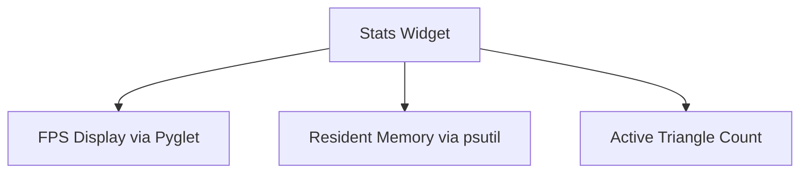

# Debugging and Stats

`pudu-ui` includes built-in performance monitoring tools to help you profile and optimize your interface during development.

---

## Enabling Debug Mode in `App`

You can activate the debug overlay directly when initializing `pudu_ui.App`:

```python
from pudu_ui import App
import pudu_ui

app = App(
    width=800,
    height=600,
    caption="Performance Profiling",
    is_debug=True
)

if __name__ == "__main__":
    app.run()
```

### What Happens in Debug Mode?

When `is_debug=True` is enabled:
1. **VSync is Disabled**: Vertical sync is turned off so that you can see true uncapped frame rates and monitor rendering bottlenecks.
2. **Debug Overlay is Displayed**: The `pudu_ui.debug.Stats` widget is automatically initialized and rendered in the bottom-left corner of the window.

---

## The `Stats` Widget

The `Stats` widget monitors three key runtime metrics:



- **Frames Per Second (FPS)**: Uses Pyglet's high-resolution `FPSDisplay` to track actual rendered frames.
- **Memory (RAM)**: Uses `psutil.Process.memory_info().rss` to display physical memory consumed by the Python process in megabytes (MB), refreshed every 0.5 seconds.
- **Triangle Count**: Tracks the total number of OpenGL triangles actively rendered by the scene.

### Programmatic Control

You can also update triangle counts or inspect the stats object directly through the `app.stats` instance:

```python
# Report custom triangle counts to the debug overlay
app.stats.set_tri_counts(total_triangles)
```
