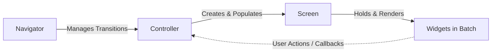

# MVC Framework

To keep complex applications and games maintainable, `pudu-ui` provides an Model-View-Controller (MVC) abstraction with `Controller`, `Screen`, and `Navigator`.

---

## The Roles



- **`Screen` (View)**: Responsible exclusively for creating and organizing UI widgets. It manages a dedicated `pyglet.graphics.Batch` and handles event routing to its child widgets.
- **`Controller` (Controller)**: Manages application state, handles business logic, and coordinates lifecycle events (`on_load`, `on_pause`, `on_resume`, `on_close`).
- **`Navigator` (Router)**: Manages screen transitions across multiple controllers, ensuring active controllers are paused/closed and new controllers are loaded.

---

## Implementing a Screen

A custom screen subclass overrides `__init__` to instantiate widgets and add them to `self.widgets`:

```python
from pudu_ui import Screen, Button, ButtonParams, Label, LabelParams

class MainMenuScreen(Screen):
    def __init__(self, on_start_clicked):
        super().__init__(name="MainMenuScreen")

        # Title Label
        title_params = LabelParams(x=200, y=400, text="My Game")
        self.title = Label(title_params, batch=self.batch)
        self.widgets.append(self.title)

        # Start Button
        btn_params = ButtonParams(
            x=200, y=300, width=150, height=40, text="Start Game"
        )
        self.start_btn = Button(
            btn_params, batch=self.batch, on_click=on_start_clicked
        )
        self.widgets.append(self.start_btn)
```

---

## Implementing a Controller

A custom controller manages screen creation and data fetching in its `on_load()` lifecycle hook:

```python
from pudu_ui import Controller

class MainMenuController(Controller):
    def on_load(self, *args, **kwargs):
        super().on_load(*args, **kwargs)

        # 1. Create the screen and inject callbacks
        self.screen = MainMenuScreen(on_start_clicked=self.start_game)

        # 2. Tell the App to display this screen
        self.app.set_screen(self.screen)

    def start_game(self):
        print("Starting game...")
        # e.g., navigator.change("GameplayController")
```

---

## Multi-Screen Navigation

When an application has multiple views (e.g. Main Menu, Settings, Gameplay), use `Navigator`:

```python
from pudu_ui.navigation import Navigator

# Initialize navigator
navigator = Navigator()

# Register your controllers
menu_controller = MainMenuController(app, name="menu")
gameplay_controller = GameplayController(app, name="gameplay")

navigator.add_controller(menu_controller)
navigator.add_controller(gameplay_controller)

# Navigate to the initial screen
navigator.change("menu")
```

When `navigator.change("gameplay")` is called:
1. `menu_controller.close()` is invoked (cleaning up resources and dereferencing the screen).
2. `gameplay_controller.load()` is invoked to instantiate and display the new screen.
